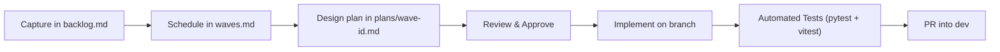

# Tanya Iman — Backlog Process

**English:** This folder is the **tactical backlog** for Tanya Iman — queueable work items (`BL-*`) grouped into **waves** with a defined resolution order. Strategic phases and architecture stay in the [Project Implementation Plan](../project-implementation-plan.md) (PIP).

**Indonesian:** Folder ini adalah **backlog taktis** untuk Tanya Iman — item kerja yang dapat dijadwalkan (`BL-*`) dikelompokkan dalam **wave** dengan urutan penyelesaian yang terarah. Fase strategis dan arsitektur tetap berada di [Project Implementation Plan](../project-implementation-plan.md) (PIP).

**Integration branch:** `dev` (wave branches merge via PR into `dev`; `main` is reserved for releases).

---

## Workflow Overview

1. **Capture**: Record work items, feature requests, or deferred tasks in [`backlog.md`](backlog.md).
2. **Prioritize**: Group tactical tasks into numbered **waves** in [`waves.md`](waves.md).
3. **Plan**: Detail architecture decisions in [`plans/`](plans/) before coding when complex.
4. **Implement & Test**: Every wave must satisfy unit tests (`cd backend && uv run pytest -v` and `npm test`) before shipping.
5. **Ship**: Update docs, mark items completed/archived, and merge into `dev`.

---

## Area Prefix Guide

| Prefix | Feature Area |
|--------|--------------|
| **BL-AUTH-** | Seeker authentication, guest access, SMS & WhatsApp OTP, account conversion |
| **BL-SEC-** | Admin authentication, JWT lifecycle, RBAC, phone encryption & HMAC hashing |
| **BL-AI-** | Answer engine, prompts, compliance validators (V1–V5), crisis guard, topic classification |
| **BL-CORP-** | Corpus ingestion, 5-site crawler, chunking, embeddings, vector search |
| **BL-ADMIN-** | Admin portal UI, question moderation, curated answers, audit logs, analytics |
| **BL-UI-** | Seeker web app, chat interface, embedded widget (`embed.js`), Android shell |
| **BL-OPS-** | Deployment scripts, GCP Cloud Run, Firebase Hosting, Firestore indexes, environments |
| **BL-TEST-** | Test infrastructure, 120-question benchmark harness, retrieval evaluation |
